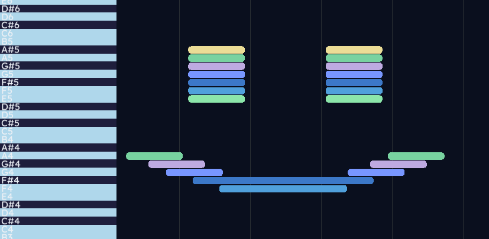

# GameMaker Audio API – TFG

<p align="center">
  
</p>

Este proyecto consiste en el desarrollo de una API de audio en C/C++ pensada para integrarse con GameMaker, con el objetivo de ofrecer un sistema más flexible y musicalmente coherente que el audio nativo del motor, así como ofrecer nuevas funcionalidades de creación musical directa.

La idea principal no es solo reproducir sonidos, sino trabajar con conceptos musicales como tempo, beats, cuantización o eventos sincronizados, algo especialmente útil en videojuegos donde el audio tiene un papel dinámico y que resulte familiar para gente que se dedique a la música.

El proyecto está dividido en tres partes principales: la API (núcleo), una herramienta de edición de partituras y dos demos de prueba.

---

## Estructura del proyecto

```
/dll                - Código C/C++ de la API (núcleo del sistema)
/gm                 - Interfaz gráfica hecha en GameMaker
/demos
   /demo_tecnica    - Pruebas de funcionalidades (tempo, buses, etc.)
   /demo_juego      - Juego de prueba con audio gestionado por la API
```

---

## 1. API de audio (DLL)

Esta es la parte principal del proyecto. Está implementada en C/C++ utilizando la librería miniaudio como base.

La API se encarga de toda la lógica de audio: reproducción, sincronización musical, gestión de eventos y organización del sonido.

### Funcionalidades principales

**Reproducción básica**

* Reproducir sonidos desde archivo
* Pausar, reanudar y detener
* Loop
* Control de volumen

**Transport musical**

* Control de BPM
* Reproducción global (play/pause/stop)
* Consulta de la posición en beats

**Cuantización**

* Posibilidad de lanzar sonidos sincronizados al siguiente beat o subdivisión
* Sistema de cola interna para eventos programados

**Secuenciador**

* Carga de canciones desde JSON
* Ejecución automática de eventos musicales
* Soporte de loop

**Sistema de buses**

* Agrupar sonidos en buses
* Control de volumen por grupo
* Mute y pan

---

### Funcionamiento interno

El sistema se basa en un "transport" musical que calcula la posición actual en beats en función del tiempo y el BPM. Esto permite que todos los eventos estén sincronizados entre sí.

El cálculo del beat se hace de forma continua, lo que permite cambiar el tempo en tiempo real sin que haya saltos bruscos.

Para evitar problemas con concurrencia, se usa un mutex global que protege todos los estados compartidos (sonidos, colas, transport, etc.).

También se implementa un sistema de eliminación diferida de sonidos para evitar conflictos con los hilos internos de miniaudio.

---

### Uso básico de la API

**Inicialización**

```c
gm_audio_init();
gm_audio_shutdown();
```

**Reproducción**

```c
int id = gm_audio_play("audio.wav");
gm_audio_pause(id);
gm_audio_resume(id);
gm_audio_stop(id);
```

**Transport**

```c
gm_audio_transport_play();
gm_audio_transport_pause();
gm_audio_transport_stop();

gm_audio_set_tempo(120);
double beat = gm_audio_get_beat_position();
```

**Cuantización**

```c
gm_audio_play_on_beat("kick.wav", 1.0);
```

Importante:
GameMaker debe llamar a `gm_audio_transport_tick()` en cada Step para que funcione correctamente la cuantización y el secuenciador.

---

### Canciones (JSON)

```c
gm_audio_song_load_file("song.json");
gm_audio_song_play();
gm_audio_song_stop();
```

---

### Buses

```c
int bus = gm_audio_bus_create();
gm_audio_bus_set_volume(bus, 0.5);
gm_audio_bus_set_mute(bus, 1);
gm_audio_assign_to_bus(sound_id, bus);
```

Para una mejor visualización del uso del API en un entorno real de GameMaker, observar la implementación de las demos presentes en el repositorio.

---

## 2. Editor de partituras (GameMaker)

Se ha desarrollado una herramienta visual en GameMaker que permite crear canciones sin necesidad de escribir JSON manualmente.

La interfaz está pensada como un piano roll sencillo.

### Funcionalidades

* Creación de instrumentos
* Edición de notas (posición, duración, altura)
* Reproducción en tiempo real
* Scroll horizontal por la canción
* Control de BPM, compases y estructura
* Exportación e importación en JSON

---

### Formato de datos

Las canciones se guardan en formato JSON con esta estructura:

```json
{
  "bpm": 120,
  "beatsPerBar": 4,
  "bars": 2,
  "loop": true,
  "instruments": [
    {
      "name": "piano",
      "file": "sounds/piano.wav",
      "baseNote": 60,
      "tuningHz": 440
    }
  ],
  "events": [
    {
      "instr": "piano",
      "note": "C4",
      "beat": 0,
      "dur": 1,
      "vel": 1,
      "bus": 0
    }
  ]
}
```

---

### Flujo de uso

1. Crear instrumentos
2. Añadir notas en el editor
3. Ajustar BPM y estructura
4. Exportar a JSON
5. Cargar el JSON desde la API

---

## 3. Demos

### Demo técnica

Incluye una prueba orientada a validar funcionalidades concretas:

* Cambio de tempo en tiempo real
* Uso de buses (mute, volumen)
* Eventos cuantizados

### Demo juego

Se ha desarrollado un pequeño juego en GameMaker donde todo el audio está gestionado por la API.

Sirve para comprobar que el sistema funciona en un entorno real, no solo en pruebas aisladas.

---

## Integración con GameMaker

La DLL se carga mediante `external_define`:

```gml
external_define("gmaudioapi.dll", "gm_audio_play", ...)
```

Y se usa con:

```gml
external_call(global.ext.play, path);
```

---

## Consideraciones importantes

* Es obligatorio llamar a `gm_audio_transport_tick()` cada frame
* La DLL debe inicializarse antes de cualquier uso
* Las rutas de archivos deben ser válidas (normalmente relativas a working_directory)

---

## Objetivo del proyecto

El objetivo de este TFG ha sido desarrollar un sistema de audio más cercano a cómo funciona la música en realidad, en lugar de limitarse a reproducir sonidos aislados.

Se ha buscado especialmente:

* Sincronización precisa
* Control musical en tiempo real
* Integración sencilla con GameMaker

---

## Posibles mejoras

* Soporte para MIDI real
* Mejor gestión de streaming de audio
* Interfaz más avanzada

---

## Autor

Antón Rodríguez Seselle
Tutor: David María Arribas

Trabajo de Fin de Grado Ingeniería de Computadores, URJC

Desarrollo de una API de audio interactiva para videojuegos.
